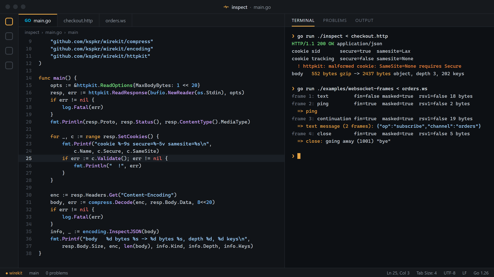

<div align="center">


# WireKit

**Go primitives for inspecting, parsing, and working with network data.**

HTTP messages, cookies, WebSocket frames, TLS handshakes and compressed bodies,<br>
as plain Go values you can inspect, change and write back. Built for proxies and traffic tools.

[](LICENSE)
[](go.mod)
[](https://github.com/kspkr/wirekit/actions/workflows/ci.yml)
[](https://pkg.go.dev/github.com/kspkr/wirekit)
[](tests)

[Packages](#packages) · [Quick start](#quick-start) · [Examples](#examples) · [Design](docs/design.md) · [Performance](#performance)

<br>



</div>

```go
req, err := httpkit.ParseRequest(raw)
if err != nil {
    return err
}
fmt.Println(req.Method, req.URL.Path, req.Host)
fmt.Println(req.Headers.Get("content-type"))   // case-insensitive, wire order kept
fmt.Println(req.Query().Get("page"))
for _, c := range req.Cookies() {
    fmt.Println(c.Name, c.Value)
}
fmt.Printf("%d body bytes, %d captured\n", req.Body.Size, req.Body.Captured())
```

## Why

The standard library parses HTTP very well for *serving* it. Inspecting traffic has different needs.

| | |
|---|---|
| **Wire fidelity** | `net/http` stores headers in a map, so their order and spelling are gone by the time you see them. WireKit keeps both. |
| **Bounded memory** | A proxy cannot buffer every body, but still wants to know how big each one was. Bodies are a retained prefix plus the true size. |
| **Lenient, with a verdict** | A debugger should show the malformed cookie a server actually sent *and* say why a browser would reject it. Parsers accept what is there; `Validate()` reports what is wrong. |
| **Hostile input by default** | Every parser is fuzzed, every size is bounded, and nothing panics on bytes an attacker wrote. |
| **Nothing else** | Not an HTTP client, not a framework, not a utility grab bag. Five focused packages, standard library only except for brotli and zstd. |

WireKit is the protocol layer extracted from [TrafficKit](https://github.com/kspkr/TrafficKit), so it could be reused by other tools and hardened on its own.

## Install

```sh
go get github.com/kspkr/wirekit/...
```

Go 1.25 or later. Packages do not depend on each other, so import only what you need.

## Packages

| Package | What it does |
|---|---|
| [`httpkit`](https://pkg.go.dev/github.com/kspkr/wirekit/httpkit) | Request and response model, ordered case-insensitive headers, cookies with RFC 6265 validation, query strings, media types, bounded body capture, an HTTP/1.x reader and writer that preserve wire order, conversion to and from `net/http` |
| [`wskit`](https://pkg.go.dev/github.com/kspkr/wirekit/wskit) | WebSocket frame parsing and serialization, streaming reader with payload limits, message reassembly, close codes, handshake and extension helpers |
| [`tlskit`](https://pkg.go.dev/github.com/kspkr/wirekit/tlskit) | Connection and certificate summaries, PEM/DER parsing, chain verification, and a ClientHello parser with SNI, ALPN and JA3 |
| [`encoding`](https://pkg.go.dev/github.com/kspkr/wirekit/encoding) | Lenient base64 and hex, hex dumps, JSON shape inspection, XSSI prefix stripping, text detection |
| [`compress`](https://pkg.go.dev/github.com/kspkr/wirekit/compress) | gzip, deflate, br and zstd decoding with output limits, so a kilobyte cannot become a gigabyte |

## Quick start

Read a response from a connection, keeping at most 1 MiB of the body, then decode and inspect it:

```go
resp, err := httpkit.ReadResponse(bufio.NewReader(conn), &httpkit.ReadOptions{
    MaxBodyBytes:  1 << 20,
    RequestMethod: "GET",
})
if err != nil {
    return err
}
fmt.Println(resp.Status())                // "200 OK"
fmt.Println(resp.ContentType().IsJSON())  // true
for _, c := range resp.SetCookies() {
    fmt.Println(c.Name, c.SameSite, c.Validate())
}

body, err := compress.Decode(resp.Headers.Get("Content-Encoding"), resp.Body.Data, 8<<20)
```

Decode one direction of a WebSocket connection into messages:

```go
r := wskit.NewReader(conn, 16<<20)
var asm wskit.Assembler
for {
    f, err := r.ReadFrame()
    if err != nil {
        break
    }
    m, err := asm.Push(f)   // joins fragments, passes control frames through
    if err != nil || m == nil {
        continue
    }
    if m.Type == wskit.OpClose {
        code, reason, _ := m.CloseInfo()
        fmt.Println("closed:", code, reason)
    }
}
```

Look at a TLS ClientHello before deciding what to do with a connection:

```go
hello, err := tlskit.ParseClientHello(peeked)
if err != nil {
    return err
}
fmt.Println(hello.ServerName, hello.ALPNProtocols, hello.JA3())
```

Record traffic in `net/http` middleware without buffering whole bodies:

```go
req := httpkit.FromRequest(r)
capture := httpkit.NewCapture(64 << 10)
r.Body = io.NopCloser(capture.TeeReader(r.Body))
next.ServeHTTP(w, r)
req.Body = capture.Body()   // first 64 KiB, plus the real size
```

## Examples

Runnable programs in [`examples/`](examples). Each package also has `Example` functions in its documentation.

| | |
|---|---|
| [`inspect-http`](examples/inspect-http) | Parse a raw request or response from stdin and print everything WireKit sees, decoding the body |
| [`websocket-frames`](examples/websocket-frames) | Decode a captured frame stream into messages |
| [`tls-inspect`](examples/tls-inspect) | Connect to a host and print the negotiated connection and certificate chain, or inspect a PEM file |
| [`proxy-capture`](examples/proxy-capture) | Record traffic through `net/http` middleware with bounded body capture and JSON output |

## How it works

```
your proxy / inspector / test
        │
        ▼
┌─────────────────────────────────────────────────────┐
│ wirekit                                             │
│  httpkit    wskit    tlskit    encoding    compress │
└─────────────────────────────────────────────────────┘
        │
        ▼
   net/http · crypto/tls · crypto/x509 · compress/*
```

A few rules hold across the module:

- **Parse, then validate.** Parsers accept anything structurally decodable so an inspector can show exactly what was sent. `Validate` methods report the rules the data breaks. HTTP/1.x framing is the exception: ambiguity that enables request smuggling is rejected, as the RFC requires.
- **Errors are classified.** Every error wraps one of a few sentinels (`ErrMalformed`, `ErrIncomplete`, `ErrTooLarge`, `ErrProtocol`, `ErrCorrupt`, `ErrInvalid`), so callers use `errors.Is` instead of matching text.
- **Sizes are bounded.** Header blocks, retained bodies, frame payloads, reassembled messages, JSON nesting and decompressed output all have limits with safe defaults.
- **Plain values.** Types have exported fields and JSON tags. Store them, compare them, serialize them.
- **The standard library does the cryptography.** `tlskit` reports what `crypto/tls` and `crypto/x509` already know; it does not implement TLS.

The reasoning behind the larger decisions, and what is deliberately left for later, is in [docs/design.md](docs/design.md).

## Performance

Parsing paths are benchmarked and allocation-aware. Numbers from one machine (Ryzen 9 7950X, Go 1.26), indicative rather than guaranteed:

| Operation | Time | Allocs |
|---|---|---|
| `httpkit.ReadRequest`, typical browser request | 3.3 µs | 42 |
| `httpkit.ReadResponse`, typical JSON response | 1.7 µs | 31 |
| `httpkit.Headers.Get` | 23 ns | 0 |
| `httpkit.ParseSetCookie`, full attribute set | 390 ns | 6 |
| `wskit.ParseFrame`, small masked frame | 28 ns | 1 |
| `wskit.ParseFrame`, 64 KiB masked payload | 3.3 GB/s | 1 |
| `wskit.ParseFrame`, 64 KiB unmasked payload (zero-copy) | 17 ns | 0 |
| `tlskit.ParseClientHello`, real client hello | 830 ns | 16 |
| `compress.Decode`, gzip | 280 MB/s | |

```sh
go test ./... -run '^$' -bench . -benchmem
```

## Security

WireKit exists to be pointed at untrusted data. Every parser has fuzz targets and malformed-input tests, and [`tests/`](tests) feeds random and mutated bytes to every entry point on each CI run. Decompression, header blocks, bodies, frames and JSON nesting are all bounded.

If you can make WireKit panic, allocate without bound, or misread a message in a way that matters, please report it privately as described in [SECURITY.md](SECURITY.md).

## Status

Pre-1.0. The API is small and settled in shape but may still change between minor versions; every change is listed in [CHANGELOG.md](CHANGELOG.md). The next consumer is TrafficKit itself.

## Contributing

Issues and pull requests are welcome. Start with [CONTRIBUTING.md](CONTRIBUTING.md), which explains what belongs in WireKit and what a change needs to be merged.

## License

[MIT](LICENSE)
